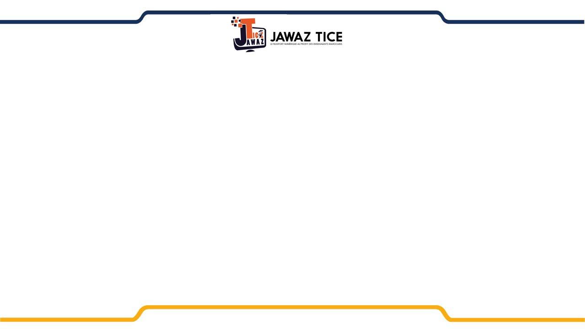
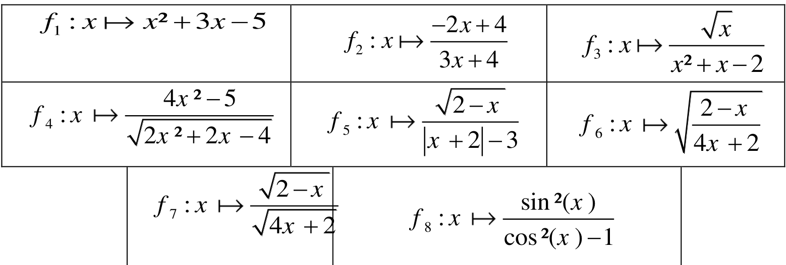
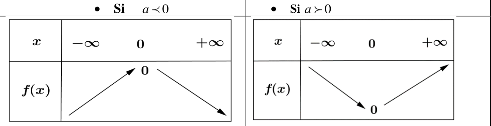
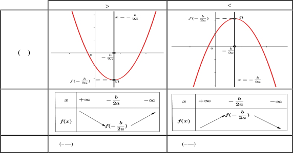
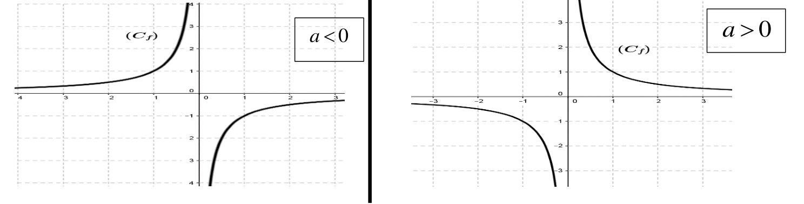
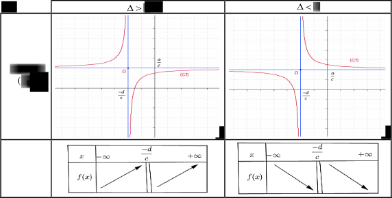
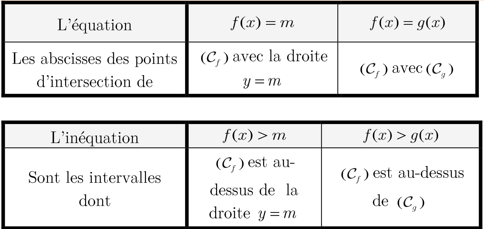

<!--Term 1-->
<!--: Definition 1-->
<!---->
<!--Term 2 with *inline markup*-->
<!--: Definition 2-->

 

# Fonctions numériques


## Fonction numérique


#### Activité :

On considere un rectangle de longueur $(x—1)cm$ et de largeur $(x—2)cm$ tel que x un réel supérieur strictement a 2.

On désigne par $f(x)$ la **surface** de ce rectangle

1. Déterminer l’expression de $f(x)$
1. Déterminer la surface du rectangle si $x=4$
1. Déterminer les valeurs possibles de $x$ si $f(x)=8$

#### définition

{width=50%}

{width=50%}

Soit $D$ une partie de $RR$

On appelle fonction numérique (noté $f$) : toute relation qui a associée chaque nombre réel $x$ de $D$ par un seul nombre réel $y$ qu’on note $f(x)$ et on écrit

$f: D -> RR $

$x -> f(x)=y$

- $f(x)=y$ : S’appelle ’image de $x$ par la fonction $f$
- Le nombre $x$ s’appelle antécédent de $y$ par la fonction $f$

#### Application

On considère une fonction numérique définie par $f(x)=3x^2-1$

1. Déterminer les images de 1 ; -2 et $3/4$ par la fonction $f$
1. Déterminer les antécédents, s’ils existent, des nombres suivants 0, 5 et -4 par la fonction $f$

## Ensemble de définition

#### Activité :

Soit $f$ une fonction numérique définie par $f(x)= 1/(x^2 -1)$

- Déterminer les images de 0 ;2 ;
- Peut on calculer les images de 1 et -1 par la fonction $f$ ?

#### définition

On appelle ==ensemble de définition== d’une fonction numérique $f$ , l’ensemble des nombres réels $x$ pour lesquels l’image $f(x)$ est ==bien définie== et se note souvent $D_f$, On écrit $D_f={x in RR // f(x) in RR}$.

#### Remarque

Pour déterminer l’ensemble de définition d’une fonction $f$ ; il faut **éliminer** tous les nombres réels pour lesquels

- le dénominateur est nul
- le nombre sous la racine carrée est négatif.

Soient $P ( x )$ et $Q ( x )$ deux fonctions polynômes.

| Fonction                              | Ensemble de definition                                            |
| ------------------------------------- | ----------------------------------------------------------------- |
| $x -> P(x)$                           | $D_f = RR$                                                        |
| $x -> ( P(x) )/( Q(x) )$              | $D_f = {x in RR // Q(x) != 0}$                                    |
| $x -> sqrt(P(x))$                     | $D_f = {x in RR // P(x) >= 0}$                                    |
| $x -> ( P(x) )/( sqrt( Q(x)) )$       | $D_f = {x in RR // Q(x) > 0}$                                     |
| $x -> sqrt(( P(x) )/( Q(x) ))$        | $D_f = {x in RR //( P(x) )/( Q(x) ) >= 0 quad et quad Q(x) != 0}$ |
| $x -> ( sqrt(P(x)) )/( sqrt( Q(x)) )$ | $D_f = {x in RR // P(x) >= 0 quad et quad Q(x) > 0}$              |

#### +Exemple

Soient $f(x) = x^3 + 3x^2 - 2$ et $f(x) = (3x-1)/(2x+1)$

#### application

Déterminer l’ensemble de définition des fonctions suivantes:

{width=100% }

## égalité de deux fonctions

#### Activité

Soit $f(x) = 1/x$ et $g(x) = x/x^2$

1. M.q : $f(x) = g(x)$
2. calculer $f(0)$ et $g(0)$

#### definition

Soient $f$ et $g$ deux fonctions.
$D_f$ et $D_g$ sont leurs ensembles de définition respectifs.

On dit que $f$ et $g$ sont ==égales==, et on écrit $f = g $, si les deux conditions suivantes sont vérifiées :

- $D_f = D_g$
- $f(x) = g(x) $ pour tout $x in D_f$

#### Exemple

Soit $f(x) = sqrt(x^2)$ et $g(x) = |x|$

#### exercices

==exercice $8$ - page : $277$==

## représentation graphique

#### Activité

On considère la fonction numérique f définie par $f(x)=2x+1$

Construire le graphe de la fonction f dans un repère orthonormé $(O, veci , vecj )$.

#### Définition :

- Dans un plan muni d’un repère $(O, veci , vecj )$ la courbe représentative d’une fonction $f$, notée souvent $(C_f) $, est l’ensemble des pointsdu plan $M(x;f(x))$ où $x in D_f$

<!-- - Autrement dit : -->
<!---->
<!-- _$M(x,y) in (C_f) \<=> x in D_f quad et quad y=f(x)$_ -->

#### Remarque :

L’équation $y= f(x) $est appelée l’équation de la courbe $(C_f)$.

#### Exemple

tracer le courbe de $f : x -> |x|$

#### Application

On considère la fonction numérique $f$ définie par : $f(x)= x^2/(x+1)$

1. Déterminer $D_f$ l'ensemble de définition de la fonction $f$ .
1. Déterminer les points appartenant à $(C_f)$ parmi les points suivants : $O(0;0) ; B(3 ; 9/4) ; C(1;1)$


#### Application

Soit la figure suivante :


1. est ce cette courbe est une fonction
2. Donner l'ensemble de définition
3. Donner les images de : $-3 ; -1 ;4$
4. Donner les antécédents de : $1 ;2$
5. est que la fonction paire ou impaire


#### exercices

==exercice $10 ,28$ - page : $277$==

## Fonction paire - Fonction impaire

#### Activité

On considère la fonction numérique $f$ définie par : $f(x) =|x| - 1$

1. Déterminer l'ensemble de définition de la fonction $f$ .
1. Soit$x in RR$, montrer que $f(-x)= f(x)$
1. Vérifiez que $f(x)=x -1 quad si quad x >= 0 quad et quad f(x)=-x -1 quad si quad x\<0 $
1. En déduire la nature de la courbe $(C_f)$ , puis tracer $C_f$ dans un repère orthonormé $(O, veci , vecj)$.
1. En déduire que la courbe $C_f$ admet ==un axe de symétrie== à déterminer.

#### Définition

Soit $D$ une partie de $RR$.

On dit que $D$ est symétrique par rapport à zéro si pour tout $x in D $ on a $—x in D$.

#### Exemple

Déterminer les parties symétriques par rapport à zéro parmi les parties suivantes :

- $\[- 2:2\]$
- $\[- 2:1\]$
- $\[- 3:-2\] uu\[2:4\] $
- $RR$
- $RR^\*\*$
- $\[0 ; +oo\[$
- $RR - {2}$

#### Définition : fonction paire

On dit que $f$ est une fonction paire si :

- Si $x in D_f $ alors $-x in D_f$ ($D_f$ est symétrique par rapport à zéro )
- Pour tout $x in D_f$ on a : $f(-x)= f(x)$

La courbe d’une fonction paire est **symétrique par rapport à l’axe des ordonnées**.

#### Exemple

soit $f(x) = 1/x^2$

#### Application

Déterminer si $f$ est une fonction paire dans les cas suivants :

- $f(x) = x^6 +3$
- $f(x) = sqrt(x) + 1 $

#### definition : fonction impaire

On dit que $f$ est une fonction impaire si :

- Si $x in D_f $ alors $-x in D_f$
- Pour tout $x in D_f$ on a : $f(-x)= - f(x)$

La courbe d’une fonction impaire est **symétrique par rapport à l’origine du repère**.

#### Application

1. étudier la parité des fonctions :

- $f(x)=2/x$
- $fx)=x^3-x$
- $f(x) = |x| - 1/x^2$
- $f(x)=sin(x)$
- $f(x)= cos(x)$
- $f(a)=tan(x)$
- $f(x) = 1/(x^2 - 2)$
- $f(x) = 3 x^2 - 2x +4$

2.  tracer une fonction paire et un fonction impaire

#### exercices

==exercice $9, 11$ - page : $277$==


## Variations d’une fonction تغيرات الدالة

#### Activité

Soit $f$ la fonction numérique représentée ci-contre :


1. Déterminer puis comparer $f(-2) $ et $f-1)$
1. Comment les valeurs de $f(x)$ change lorsque les valeurs de $x$ augmentes sur $\[—2;0\] $ ?
1. Déterminer puis comparer $f(2)$ et $f(1)$ .
1. Comment les valeurs de $f(x)$ change lorsque les valeurs de $x$ augmentes sur $\[0;2\]$ ?

#### definition

Soit la fonction $f$ et $a , b in D_f$

- Si $a > b$ et $f(a) >= f(b)$ alors $f$ est **croissante(تزايدية)**
- Si $a > b$ et $f(a) > f(b)$ alors $f$ est **strictement croissante**
- Si $a > b$ et $f(a)\<= f(b)$ alors $f$ est **décroissante(تناقصية)**
- Si $a > b$ et $f(a)\< f(b)$ alors $f$ est **strictement décroissante**
- Si $a > b$ et $f(a) = f(b)$ alors $f$ est **constante(تابثة)**

#### Exemple

Soit $f(x) = -x +3 $

#### Exemple

Soit la fonction $f$


donner les variations de $f$

#### propriété : Taux de variation

Soit $f$ une fonction définie sur $D$ et $a , b in D$

le Taux de variation est $T= (f(a) - f(b))/(a-b)$

- Si $T>= 0 $ alors $f$ est croissante sur $I$
- Si $T\<= 0 $ alors $f$ est décroissante sur $I$
- Si $T = 0 $ alors $f$ est constante sur $I$

#### Exemple

Soit $f(x) = 2x +1$

#### Application

Soit $f(x) = x^2 - 4x +3 $

1. monter que le taux le variation est : $T = a+b -4$
1. étudier la monotonie de $f$ sur $]-oo ; 2]$ et $[2 ; +oo[$
1. dresser le tableau de variation de $f$

#### exercices

==exercice $14$ - page : $277$==

#### exercice

Soit $f(x) = (-x+2)/(x-1) $

1. Soit $x , y in D_f$ Montrer que $f(x) -f(y) = (-(x-y))/((x-1)(y-1))$
1. déduire que le taux le variation est : $T = (-1)/((x-1)(y-1))$
1. étudier la monotonie de $f$ sur $\]-oo ; 1\]$ et $\[1 ; +oo\[$
1. dresser le tableau de variation de $f$


## Maximum et minimum d’une fonction

#### Définition

Soit $f$ une fonction définie sur $I$

1. On dit $m$ est un minimum (une valeur minimale) de $f$ sur $I$ si pour tout $x in I$ on $f(x) >= m$
1. On dit $M$ est un maximum (une valeur maximale) sur $I$ si pour tout $x in I$ on $f(x)\<= M$
1. un extremum = minimum **ou** maximum

#### Exemple

Soit f une fonction définie par $f(x) = x +1/x$

1. Montrer que 2 est le minimum de f sur $RR\_{\*\* }^+$
1. Montrer que -2 est le maximum de f sur $RR\_{\*\* }^-$

 

#### Physique


<iframe src="https://prezi.com/p/embed/pltt7twruzlq/" id="iframe_container" frameborder="0" webkitallowfullscreen="" mozallowfullscreen="" allowfullscreen="" allow="autoplay; fullscreen" height="315" width="560"></iframe>

## Parabole et Hyperbole

<!-- ```{latex} -->

<!-- \begin{tikzpicture} -->

<!---->

<!-- \draw [<->](-3,0)--(3,0); \draw (-2,-.2)--(-2,.2); \draw (-1,-.2)--(-1,.2); -->

<!-- \draw(0,-.2)--(0,.2); \draw (1,-.2)--(1,.2); \draw (2,-.2)--(2,.2); -->

<!-- \node[align=left,below] at (-4.5,-0.2) {Cash flow}; \node[align=left,above] at -->

<!-- (-4.5,0.2) {Time period}; \node[align=left,above] at (-2,0.2) {-2}; -->

<!-- \node[align=left,above] at (-1,0.2) {-1}; \node[align=left,above] at (0,0.2) -->

<!-- {0}; \node[align=left,above] at (1,0.2) {+1}; \node[align=left,above] at (2,0.2) -->

<!-- {+2}; \node[align=left,below] at (1,-0.2) {\$100}; \node[align=left,below] at -->

<!-- (2,-0.2) {\$100}; -->

<!-- \end{tikzpicture} -->

<!-- ``` -->

### Fonction $x -> ax^2$

#### Activité

Soit $f$ une fonction définie sur $RR$ par $f(x)=2x^2 $ et $(C_f )$ sa courbe dans un repère orthonormé.

1. Etudier la parité de la fonction $f$ .
1. Déduire la propriété géométrique de $C_f$
1. Etudier la monotonie sur $RR^+$ puis déduire la monotonie sur $RR^-$.
1. Dresser le tableau de variation
1. Construire $C_f$ la courbe de la fonction $f$ dans un repère orthonormé.
1. Refaire les mêmes questions pour la fonction $g$ qui est définie par $g(x)=—2x^2$

#### Définition

Soit $a in RR^\*\*$ .

La courbe  de la fonction  $f(x) = ax^2$  s’appelle une ==parabole== ,

- **le sommet** l’origine du repère 
- **l`axe de symétrie** est l’axe des ordonnés (x=0) .

Les variations de  $f$ :
<!---->
<!-- - Si $a>0$ alors la fonction est croissante sur $RR^+$ et décroissante sur $RR^-$ -->
<!-- - Si $a\<0$ alors la fonction est croissante sur $RR^-$ et décroissante sur $RR^+$ -->



#### Exemple

$f(x) = 2 x^2$


#### Application

Soit f une fonction sur $RR$ définie par $ f(x)= - 1/2 x^2 $

1. Dresser le tableau de variation sur $RR$.
1. Donner la nature de $C_f$ en précisant ses éléments caractéristiques.
1. Construire $C_f$ .

### Fonction $f(x) = ax^2 +bx +c$

#### activité

Soit $f(x) = ax^2 +bx +c$

1. monter que  $f(x) = a(x+b/(2a))^2 - Delta/(4a) $
2. trouver X et Y tel que : $f(x)=aX^2 + Y$
3. donner les propriétés de $C_f$

 

#### propriété 

Soit $f(x) = ax^2 +bx +c$

la forme canonique de f est : $f(x) = a(x+b/(2a))^2 - Delta/(4a) $

la courbe de f est une parabole de sommet $Omega(-b/( 2a ) ; f(-b/( 2a ))) $ et d'axe de symétrie $x = -b/(2a)$



#### Application

On considère la fonction f définie par : $f(x) = 2x^2 - 5x -3 $

1. Déterminer $D_f$ lensemble de définition de la fonction f
1. monter que $f(x) = 2(x-5/4)^2 - 49/8$
1. Dresser le tableau de variations de $f$
1. Déterminer la nature et les éléments caractéristiques de la courbe $C_f$
1. Tracer $( C_f )$ dans un repère orthonormé $(O;vec(i);vec(j) )$

### Fonction $x -> a/x$

#### Activité

Soit $f$ une fonction définie sur $RR$ par $f(x)=1/x $ et $a in RR$

1. Déterminer $D_f$
1. Etudier la parité de la fonction $f$ .
1. Déduire la propriété géométrique de $C_f$
1. Etudier la monotonie sur $RR\_{\*\* }^+$ , puis déduire la monotonie sur $RR\_(\*\*)^-$.
1. Dresser le tableau de variation
1. Construire $C_f$ la courbe de la fonction $f$ dans un repère orthonormé.

#### Définition

La courbe de la fonction $f=a/x$ s’appelle une hyperbole de centre $O$ et d’asymptotes les droites d’équations $x=0$ et $y=0$




#### Application

Soit f une fonction sur $RR$ définie par $ f(x)= 3/x$

1. Dresser le tableau de variation sur $RR$.
1. Donner la nature de $C_f$ en précisant ses éléments caractéristiques.
1. Construire $C_f$ .

#### propriété : fonction périodique

On dit que $f$ est une fonction périodique de période $T$ si pour tout $x in D_f$ :

- $(x+T) in D_f$
- $f(x+T) = f(x)$

#### Exemple

On a $sin(x+2 pi ) = sin(x)$ et $cos(x+ 2pi )= cos (x)$ alors $sin(x)$ et $cos(x)$ sont des fonctions périodiques de période :$T= 2 pi$


#### propriété : $f(x) = (ax+b)/(cx+d) $

Soit la fonction $f(x) = (ax+b)/(cx+d) $

la formule réduite de f est : $f(x) = beta + lambda/(x+ alpha)$

La courbe de la fonction f est **une hyperbole** de :

- Centre :  $Omega(-d/c ; a/c) $
- Asymptotes : $x=-d/c$ et $y=a/c$

Soit $Delta = a xx d - c xx b$



#### Application

On considère la fonction f définie par : $f(x) = (-x+2)/(x-1)$

1. Déterminer $D_f$ lensemble de définition de la fonction f
1. monter que $f(x) = -1 + 1/(x-1)$
1. Dresser le tableau de variations de $f$
1. Déterminer la nature et les éléments caractéristiques de la courbe $C_f$
1. Tracer $( C_f )$ dans un repère orthonormé $(O;vec(i); vec(j) )$

## Résolution graphique des équations et des inéquations

#### propriété



#### Exemple

Soit $f(x) = -x^2 +3$ et $g(x) = -x +1$

1. Résoudre algébriquement et graphiquement :
   - $f(x) = g(x)$
   - $f(x) >= g(x)$
   - $f(x)\<= g(x)$


#### Application


