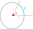
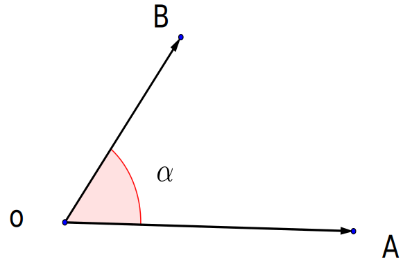
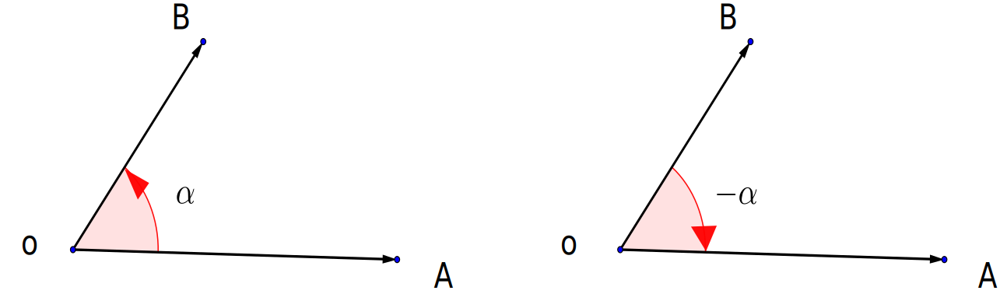

# Calcul trigonométrique

## Cercle trigonométrique – Abscisse curviligne

#### révision

1. donner le périmètre (المحيط) d'un cercle
2. donner la relation entre l'abscisse d'un point et la distance de l'origine
3. l'origine des mots triangle et trigonométrique

[valeur de $pi$](./images/10,000_digits_of_pi_-_poster.svg)

#### activité

On considère le cercle $(C)$ de centre $O$ et de rayon $r=1$ (Voir la figure
ci-dessous).

1. donner le périmètre (المحيط) du cercle $C$
2. Déduire la longueur de l'arc $hat(II')$ , $hat(IJ)$ et $hat(IJ')$
   <!-- 3. Déduire la longueur de $hat(IJ')$ et $hat(IJ)$ qui ne contient pas $I'$ -->
3. soit $I$ l'origine des abscisses des points sur le cercle donner les
   abscisses de $I , J , I' ,J'$
4. combien des abscisses on a pour chaque points du cercle
5. donner une relation entre les les abscisses de points $I$ et le nombre des
   tours $k$

<!-- 3. ,, $quad$,, la longueur de l'arc $hat(IJ)$ -->

 

 

#### +def

le cercle trigonométrique:

- son centre est $O$
- son rayon est $r = 1 (\"unité\")$
- orienté positif (عكس عقارب الساعة ).
- muni d’un origine $I$

<!-- - lié a un repère orthonormé direct $(O, veci ,vecj)$ -->

Tout point $M$ de cercle trigonométrique s’associe par à un nombre réel
s’appelle **abscisse curviligne** du point et on écrit $M(x)$ .

#### remarque

- Tout point du cercle trigonométrique admet une **infinité** d’abscisses
  curvilignes.
- si $x$ et $x'$ des abscisses de même point alors $x' = x + 2k pi // k in ZZ$
  et on écrit $x' -= x [2 pi]$ (se lit ==$x'$ est congru a $x$ modulo $2 pi$== )
- l'abscisse curviligne appartient à l’intervalle $]-pi ; pi]$ et s’appelle
  abscisse ==curviligne principale== .

#### Exemple 1

Soit le cercle trigonométrique $C$ on a :

- $I(...)$
- $J(...)$
- $I'(.... )$
- $J'(....)$

- pour le point $I$ on a : $I(...)$ $I(..... )$ $I(...)$ $I(... )$ $I(... )$
  $I(-2pi )$
- on a $.... in ]-pi ; pi]$ alors $.... $ est abscisse curviligne principale de
  $I$

#### Exemple 2

Déterminer l’abscisse curviligne principale du point $A((25pi)/4)$

#### +app

Déterminer les abscisses curvilignes principales des points suivants :

- $A((7pi)/2)$
- $B((67pi)/4)$
- $C((267pi)/6)$
- $D((-11pi)/3)$
- $E(1002pi)$
- $F(13pi)$

## Angles orientés

#### +def

- la mesure d’un angle $theta$ en **radian** ($rad$) est La longueur de l’arc
  $S$ intercepte par l’angle $theta$ sur le rayon du cercle $r$

{width=300px}

_$theta$ en radian $= s/r$_

- Si $r=1$ on a : ==mesure en radian = abscisse curviligne==

<!-- - la mesure d’un angle plat en radian est égale à $pi quad rad$. -->

<!-- - Il existe une autre unité de mesure des angles s’appelle le grade et se note -->
<!--   $gr$ telle que la mesure d’un angle plat en grade est égale à $200gr$. -->

- Il existe une autre unité de mesure des angles s’appelle le **grade** $gr$
- on a : ==$180^o = pi quad rad = 200 quad gr $==

 

 

#### remarque

⚠️ vérifier l'unité dans le
calculatrice avant calculer : $r$ pour $rad$ et $d$ pour $degré$

[meme](./images/radians.jpg){ data-lightbox="image-5" }

#### +app

1. Compléter le tableau suivant :

| Mesure en degré | Mesure de l’angle en radian |
| --------------- | --------------------------- |
| $180^o$         | $pi $                       |
| $60^o$          | ........                    |
| ...........     | $pi/2$                      |
| $45^o$          | .........                   |
| ...........     | $pi$                        |
| $30^o$          | .........                   |
| ...........     | $( 3pi )/2$                 |
| ...........     | $1$                         |

2. Placer $A(pi/6)$; $B(pi/4)$ ; $C(pi/3)$ ; $D((13pi)/2)$ sur le cercle
   trigonométrique

#### remarque

[remarque](./images/3.svg){ data-lightbox="image-4" }

#### +def

soit $A$ , $B$ et $O$ trois points distincts

- Les deux angles $hat(AOB)$ et ̂$hat(BOA)$ sont des angles géométriques de même
  mesure, toujours **positive** : $hat(AOB)$ = $hat(BOA)$ ;
- L'angle $hat( vec(OA) , vec(OB))$ est un ==angle orienté== (On tourne de
  $vec(OA)$ vers $vec(OB)$ )
- la mesure de $hat(vec(OA) ; vec(OB))$ est noté : $bar(vec(OA) ; vec(OB))$

_$hat(AOB)$ = $hat(BOA) = alpha$_

$bar(vec(OA) ,vec(OB)) = alpha$ $ +q $ $bar(vec(OB) ,vec(OA)) = - alpha$ $ +q $
$bar(vec(OA) ,vec(OB)) = - bar(vec(OB) ,vec(OA))$

#### remarque

Soit $x$ la mesure d'un angle orienté $hat(vec(u) , vec(v))$

- Si $x'= x+ 2k pi // k in ZZ$ alors $x'$ est aussi une mesure de $hat(vec(u) ,
  vec(v))$ et on a : $x' -= x [2pi]$
- Si $x in ]-pi ; pi]$ alors $x$ est la mesure principale de l'angle orienté
  $hat(vec(u) , vec(v))$

#### Exemple

Déterminer la mesure principale de l'angle $(25pi)/4$

#### propriété

soit $vecu$ , $vecv$ et $vecw$ trois vecteurs:

$bar(vec(u) , vec(v)) -= 2k pi + alpha [2pi] -= alpha [2pi] $

$( bar(vec(u) , vec(v)) ) -= - (bar(vec(v) , vec(u))) [2pi]$

$bar(vec(u) , vec(v)) + bar(vec(v) , vec(w)) -= bar(vec(u) , vec(w)) [2pi]$ ~~$
-> color(red)(\"Relation de Chasles\")$~~

$$

#### application

soit la figure suivant :

<object id="my-svg" type="image/svg+xml" data="./images/geogebra-export.svg"></object>

Déterminer $bar(vec(u) , vec(w))$ et $bar(vec(w) , vec(u))$

#### activité

soit $vecu$ , $vecv$ deux vecteurs avec $bar(vec(u) , vec(v)) -= alpha [2pi]$ et
$a, b in RR$:

donner les mesures des angles suivants en fonctions de $alpha$ :

- $bar(- vec(u) , vec(v))$
- $bar(- vec(u) , - vec(v))$
- $bar(a vec(u) , b vec(v))$

#### application

placer les points suivants sur le cercle trigonométrique :
 

 
