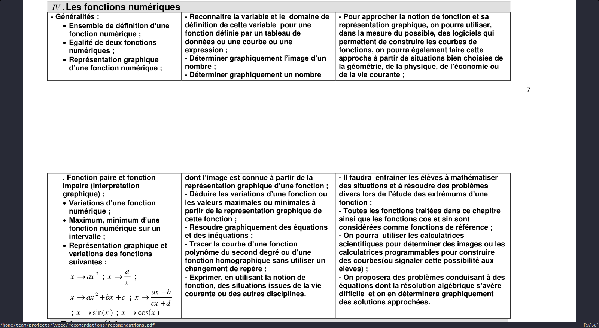

| Niveau | Chapitre             | Devoir | Volume hohaire | Date                    | Semester |
| ------ | -------------------- | ------ | -------------- | ----------------------- | -------- |
| TCS    | Fonctions numériques | 5      | 19             | 05/04/2024 - 01/05/2024 | 2        |

<!-- ##### Niveau des PRE-REQUIS : ......... / 10 -->
<!---->
<!-- ##### Satisfaction : ......... / 10 -->
<!---->
<!-- ##### Notes : -->

---
